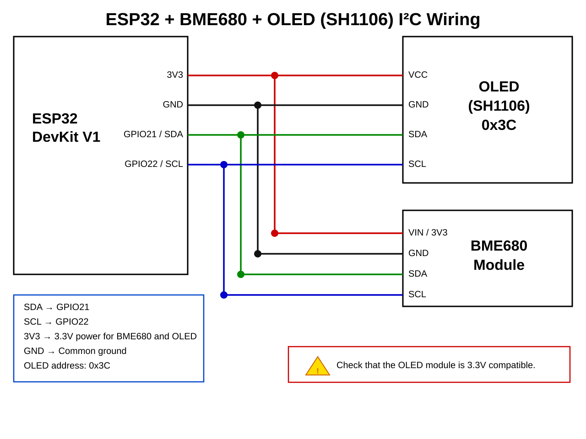

# ESP32 BME680 IAQ + OLED + RPi server

[](LICENSE)

ESP32 reads a **BME680** (BSEC library), shows data on a small I²C OLED, and POSTs sensor data to a Raspberry Pi server. The RPi serves a webpage with the live values. Between readings the ESP32 enters **deep sleep** to save power.

## What's in this repo
- `ESP32_BME680.ino` – ESP32 sketch (battery / deep-sleep variant)
- `ESP32_BME680_usb.ino` – ESP32 sketch for always-on USB-powered installations (no deep sleep, EEPROM BSEC state)
- `pi_server` – notes/commands for the RPi server setup & service
- `wiring.svg` – wiring diagram

## USB-powered variant (`ESP32_BME680_usb.ino`)

`ESP32_BME680_usb.ino` is intended for an ESP32 that lives in a fixed location (e.g. a living-room USB outlet) and is always powered. Key differences from the deep-sleep sketch:

| Feature | `ESP32_BME680.ino` | `ESP32_BME680_usb.ino` |
|---|---|---|
| Power management | Deep sleep between readings | No deep sleep — runs continuously |
| BSEC state storage | NVS via `Preferences` | EEPROM |
| BSEC state save trigger | Every successful reading | Every 4 hours when accuracy ≥ 3 |
| OTA support | Yes — timed window per wake | Yes — always available |
| OTA hostname | `esp32-bme680` | `esp32-bme680-usb` |
| Loop interval | One shot per wake | 3 s (BSEC LP sample rate) |

### BSEC state saving (EEPROM)

The sketch saves the BSEC calibration state to EEPROM every **4 hours**, but only when IAQ accuracy has reached level 3 (fully calibrated). On the next reboot the state is restored, so the sensor re-reaches high accuracy much faster than starting from scratch.

```cpp
#define EEPROM_SIZE (BSEC_MAX_STATE_BLOB_SIZE + 10)
const unsigned long BSEC_STATE_SAVE_INTERVAL_MS = 4 * 60 * 60 * 1000; // 4 hours
```

### Configuration

Edit these constants near the top of `ESP32_BME680_usb.ino`:

```cpp
const char* ssid       = "YOUR_WIFI_SSID";
const char* password   = "YOUR_WIFI_PASSWORD";
const char* serverName = "http://<rpi-ip>:3000/sensor-data";
```

```cpp
// Timezone (default: CET/CEST)
const char* timeZone = "CET-1CEST,M3.5.0,M10.5.0/3";
```

```cpp
// OTA hostname (shown in Arduino IDE Tools → Port)
#define OTA_HOSTNAME "esp32-bme680-usb"
```

### OTA updates (USB variant)

Because the USB sketch runs continuously, the OTA service is **always active** — there is no timed window to hit. To push a firmware update:

1. Open the sketch in Arduino IDE.
2. Select **esp32-bme680-usb** from **Tools → Port** (appears once the device is on the network).
3. Upload normally. The OLED shows "OTA update..." during the flash and "OTA done. Rebooting..." on completion.

### Run flow

```
Power-on / USB connected
        │
        ├─ Initialize OLED + EEPROM
        │
        ├─ Connect WiFi
        │
        ├─ Start OTA service (hostname: esp32-bme680-usb)
        │
        ├─ Sync NTP time
        │
        ├─ Init BSEC, restore saved calibration state (EEPROM)
        │
        └─ Loop every 3 s:
              ├─ Read BSEC (temperature, humidity, pressure, IAQ, CO₂, VOC)
              ├─ POST JSON to RPi server
              ├─ Update OLED display
              ├─ Save BSEC state to EEPROM if accuracy=3 and 4 h elapsed
              └─ Service OTA (always listening)
```

## Libraries required

Install all of these via the Arduino Library Manager or manually:

| Library | Purpose |
|---|---|
| [BSEC Software Library](https://github.com/boschsensortec/BSEC-Arduino-library) | Bosch BSEC algorithm (IAQ, CO₂, VOC) |
| Adafruit GFX Library | Graphics primitives |
| Adafruit SH110X | SH1106 OLED driver |

The following are part of the **ESP32 Arduino core** (no separate install needed): `WiFi`, `Wire`, `HTTPClient`, `ArduinoOTA`, `Preferences`, `EEPROM`, `time`.

> **BSEC note:** The BSEC library includes a pre-compiled binary. Follow the [Bosch BSEC integration guide](https://github.com/boschsensortec/BSEC-Arduino-library) to configure the build flags correctly in `platform.txt`.

## Wiring (I²C)

Both the OLED and BME680 share the I²C bus.



| Signal | ESP32 pin | Notes |
|---|---|---|
| SDA | GPIO 21 | I²C data |
| SCL | GPIO 22 | I²C clock |
| 3V3 | 3.3V | Power for BME680 + OLED (check your OLED voltage) |
| GND | GND | Common ground |

**OLED:** SH1106 128×64 @ `0x3C` (default), driven by `Adafruit_SH1106G`

**BME680:** `BME68X_I2C_ADDR_HIGH` (`0x77`) — change to `BME68X_I2C_ADDR_LOW` (`0x76`) if your module's SDO pin is pulled low.

### Board pinout reference
- https://randomnerdtutorials.com/esp32-pinout-reference-gpios/
- https://components101.com/microcontrollers/esp32-devkitc

## Configuration

Edit these constants near the top of `ESP32_BME680.ino`:

```cpp
// Credentials / server
const char* ssid       = "YOUR_WIFI_SSID";
const char* password   = "YOUR_WIFI_PASSWORD";
const char* serverName = "http://<rpi-ip>:3000/sensor-data";
```

```cpp
// Timing
#define SLEEP_DURATION_S   30     // seconds between readings
#define OTA_WINDOW_BOOT_MS 20000  // OTA window on first/power-on boot (ms)
#define OTA_WINDOW_WAKE_MS 4000   // OTA window on each deep-sleep wake (ms)
#define BSEC_READ_TIMEOUT  12000  // max ms to wait for a BSEC reading
#define WIFI_TIMEOUT_MS    15000  // max ms to wait for WiFi connection
```

**Timezone:** The sketch defaults to CET/CEST (Central European Time). Update the `TZ` string in `setup()` for your region — see the [POSIX TZ format list](https://github.com/nayarsystems/posix_tz_db/blob/master/zones.csv).

## Boot flow & deep sleep

The device uses deep sleep between readings. On every wake the sketch runs `setup()` from the beginning; `loop()` is never reached.

```
Power-on / timer wake
        │
        ├─ Connect WiFi
        │
        ├─ Sync NTP time (CET/CEST)
        │
        ├─ OTA window
        │     • first boot  → 20 s   (time to push a firmware update)
        │     • timer wake  →  4 s
        │
        ├─ Init BSEC, restore saved calibration state (NVS)
        │
        ├─ Poll BSEC until valid reading (up to 12 s)
        │
        ├─ Save BSEC calibration state to NVS
        │
        ├─ POST JSON to RPi server
        │
        ├─ Update OLED display
        │
        └─ Deep sleep for 30 s  ──► repeat
```

**BSEC state persistence:** Calibration data is saved to ESP32 NVS (non-volatile storage) via `Preferences` after each successful reading and restored on the next wake. This means the IAQ accuracy improves faster after a power cycle — accuracy level 3 (fully calibrated) is reached sooner.

## OTA updates

Both sketches support ArduinoOTA. They use different hostnames so they can coexist on the same network.

### Deep-sleep variant (`esp32-bme680`)

OTA is available only during a short window after each wake:

| Wake type | OTA window |
|---|---|
| First / power-on boot | 20 s |
| Timer wake (deep sleep) | 4 s |

1. Open the sketch in Arduino IDE.
2. Power-cycle (or let the device wake from sleep) — the OTA window opens automatically.
3. Select **esp32-bme680** from **Tools → Port** and upload normally.

### USB variant (`esp32-bme680-usb`)

OTA is always active (see [USB variant OTA section](#ota-updates-usb-variant) above).

## JSON payload sent to RPi

```json
{
  "temperature": <float>,   // °C (heat-compensated by BSEC)
  "humidity":    <float>,   // % RH (heat-compensated by BSEC)
  "pressure":    <float>,   // hPa
  "IAQ":         <float>,   // static IAQ index (0–500)
  "carbon":      <float>,   // estimated CO₂ equivalent (ppm)
  "VOC":         <float>,   // breath VOC equivalent (ppm)
  "IAQsts":      "<string>" // human-readable air quality label
}
```

### IAQ index scale

| IAQ range | Label |
|---|---|
| 0 – 50 | Excellent |
| 51 – 100 | Good |
| 101 – 150 | Lightly polluted |
| 151 – 200 | Moderately polluted |
| 201 – 250 | Heavily polluted |
| 251 – 350 | Severely polluted |
| > 350 | Extremely polluted |

### IAQ accuracy levels

The BSEC `iaqAccuracy` field (shown on the OLED as `Acc:`) indicates calibration status:

| Value | Meaning |
|---|---|
| 0 | Stabilisation / insufficient data |
| 1 | Low accuracy — sensor still calibrating |
| 2 | Medium accuracy |
| 3 | High accuracy — fully calibrated |

Accuracy reaches 3 after the sensor has been running for a while in varying air conditions. The saved NVS state helps this persist across reboots.

## RPi server setup

The ESP32 POSTs JSON to the RPi at `/sensor-data` on port 3000. The `pi_server` file contains the commands used to set up the service, with key steps summarised below.

### Systemd service

```bash
sudo systemctl daemon-reload
sudo systemctl restart ESP32_IAQ.service
sudo systemctl status ESP32_IAQ.service
```

### Port redirect (80 → 3000)

```bash
sudo iptables -t nat -A PREROUTING -p tcp --dport 80 -j REDIRECT --to-port 3000
sudo iptables -t nat -L   # verify rule is in place
```

### Verify Node.js is listening

```bash
sudo netstat -tulpn | grep LISTEN   # should show node on :3000
```

### Disable conflicting web servers

```bash
sudo systemctl stop apache2 && sudo systemctl disable apache2
sudo systemctl stop nginx
```

## Notes

- The OLED displays date/time, temperature, humidity, pressure, IAQ, CO₂, VOC, air quality label, accuracy level, and a sleep countdown.
- Time is shown only after NTP sync succeeds (`now > 24 * 3600`); until then it shows "Syncing time...".
- If BSEC reports a fatal error, the built-in LED blinks rapidly and the sketch halts.
